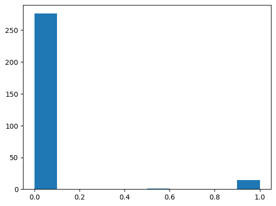

# CNN-based Manufacturing Defect Detection (Portfolio Project)

## 1. Problem

In manufacturing environments, missing defective products (false negatives) can cause serious financial and safety risks.

This project focuses not only on achieving high accuracy,
but on building a **reliable defect detection system under severe class imbalance**.

---

## 2. Engineering Focus (What I Did)

- Built a CNN classifier using TensorFlow + AutoKeras
- Designed evaluation prioritizing **Recall** instead of accuracy
- Investigated dataset imbalance and potential evaluation bias
- Verified model reliability using multiple metrics:
  Precision, Recall, F1-score, Confusion Matrix, ROC Curve
- Documented risks such as small dataset size and possible data similarity

---

## 3. Dataset

Highly imbalanced dataset:

| Split | Normal | Defective |
|------:|-------:|----------:|
| Train | 1102   | 59        |
| Test  | 276    | 15        |

---

## 4. Approach

### Preprocessing
- Resize images to 256x256  
- Normalize pixel values to [0,1]  
- Convert to RGB  
- Label encoding (0 normal / 1 defect)

### Model
- AutoKeras ImageClassifier
- Binary Cross Entropy loss
- Validation split 0.2
- Epochs 3

---

## 5. Evaluation Strategy

Instead of relying on accuracy alone,
the evaluation prioritized **Recall**, because missing defective products is the most critical failure in real production systems.

Metrics used:

- Accuracy
- Precision
- **Recall (Primary Metric)**
- F1-score
- Confusion Matrix
- ROC Curve

---

## 6. Results & Reliability Discussion

The model showed strong performance on the test dataset.

However, due to:

- small dataset size  
- severe class imbalance  
- possible similarity between training and test samples  

the result may be optimistic.

Additional validation such as cross-validation or external datasets would be required for production deployment.

---

## 7. Visual Results

### ROC Curve

### Prediction Probability Distribution

---

## 8. Key Engineering Learnings

This project demonstrated that:

- High accuracy alone does not guarantee reliability
- Dataset structure and evaluation bias must be verified
- Model validation must consider real operational risks

---

## 9. How to Run

1. Open `notebook.ipynb` in Google Colab  
2. Mount Google Drive and set dataset path  
3. Run all cells  

---

## 10. Future Work (Toward Production)

- Data augmentation
- Class weighting
- Cross-validation
- Larger dataset collection
- REST API deployment for automated inspection
- Logging prediction results for monitoring
